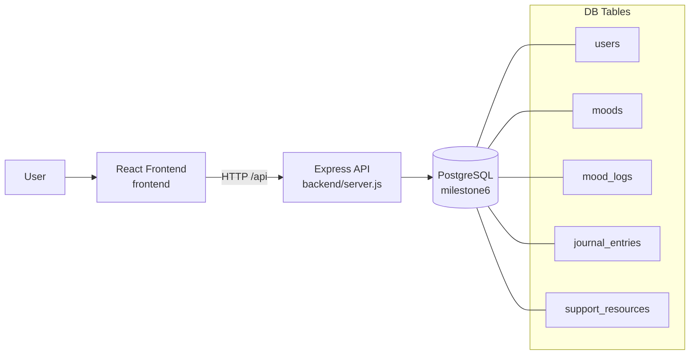

# Description

This is a mental-health support app. Its goal is to provide resources for those that are supporting someone dealing with mental health challenges such as being suicidal as well as providing resources to support the struggling individual themself. It allows users them to check in on their mood, journal safely, and access support resources for themselves or for loved ones. The problem that it solves is mainly the lack of easy access to simple and helpful resources and plans that can make a real quick differences in the lives of supporters. The primary user would be someone who is supporting a struggling family member or friend. The project demonstrates a complete frontend + backend + PostgreSQL workflow with persistent data.

## Product Value
- Gives users a low-friction place to log mood and journal entries.
- Provides quick access to crisis and support resources.
- Supports account-based persistence so saved entries belong to the logged-in user.

## Tech Stack (By Layer)
- Frontend: React, TypeScript, Vite, Tailwind CSS, shadcn ui
- Backend API: Node.js, Express, dotenv, CORS
- Database: PostgreSQL (SQL scripts for schema + seed)
- Tooling: npm, nodemon, psql

## Architecture



## Database Design
The schema contains 5 tables:
1. `users`
2. `moods`
3. `mood_logs`
4. `journal_entries`
5. `support_resources`

ERD alignment note: the original concept included `users`, `journal_entries`, and `mood_logs`; `moods` and `support_resources` were added to support lookup data/resources and meet the 5-table requirement.

## Prerequisites
- Node.js 18+
- PostgreSQL installed and running
- `psql` CLI available in your terminal

## Environment Setup
From repo root:

```powershell
Copy-Item backend\.env.example backend\.env
Copy-Item frontend\.env.example frontend\.env
```

`backend/.env` should point to your local DB credentials (default DB name used here is `milestone6`).

## Recreate Database (Exact Steps)
From repo root:

```powershell
cd db
psql -U postgres -d milestone6 -c "DROP SCHEMA public CASCADE; CREATE SCHEMA public;"
psql -U postgres -d milestone6 -f schema.sql
psql -U postgres -d milestone6 -f seed.sql
```

Quick DB verification:

```powershell
psql -U postgres -d milestone6 -c "\dt"
psql -U postgres -d milestone6 -c "SELECT COUNT(*) AS users_count FROM users;"
psql -U postgres -d milestone6 -c "SELECT COUNT(*) AS moods_count FROM moods;"
```

## Run the App Locally
Use two terminals.

Terminal 1 (Backend):

```powershell
cd backend
npm install
npm run dev
```

Terminal 2 (Frontend):

```powershell
cd frontend
npm install
npm run dev
```

Open the frontend URL shown by Vite (typically `http://localhost:5173`).

## Vertical Slice Verification (Button -> API -> DB -> Persisted)
This verifies the `Save Journal Entry` and `Save Mood Check-In` flow.

1. Open `/auth` and sign up or log in.
2. Confirm top-right shows account name.
3. Go to `/for-me`.
4. Choose a mood and click `Save Mood Check-In`.
5. Expand `Therapeutic Journaling`, type text, click `Save Journal Entry`.
6. Confirm UI feedback toast appears for each save.
7. Verify DB rows were inserted:

```powershell
psql -U postgres -d milestone6 -c "SELECT ml.id, u.email, m.code AS mood, ml.logged_at FROM mood_logs ml JOIN users u ON u.id = ml.user_id JOIN moods m ON m.id = ml.mood_id ORDER BY ml.id DESC LIMIT 5;"
psql -U postgres -d milestone6 -c "SELECT je.id, u.email, je.content, je.created_at FROM journal_entries je JOIN users u ON u.id = je.user_id ORDER BY je.id DESC LIMIT 5;"
```

8. Refresh the page and rerun the SQL queries above; rows remain in DB (persistent after refresh).

## API Endpoints Used
- `POST /api/auth/signup`
- `POST /api/auth/login`
- `POST /api/mood-logs`
- `POST /api/journal-entries`
- `GET /api/health`

## Notes / Current Limitations
- Authentication is sessionless and stored client-side for this milestone.
- Passwords are stored as plain text for assignment simplicity (not production-safe).
