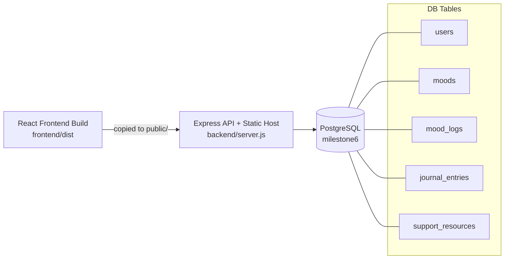

# Description

This is a mental-health support app. Its goal is to provide resources for those that are supporting someone dealing with mental health challenges such as being suicidal as well as providing resources to support the struggling individual themself. It allows users them to check in on their mood, journal safely, and access support resources for themselves or for loved ones. The problem that it solves is mainly the lack of easy access to simple and helpful resources and plans that can make a real quick differences in the lives of supporters. The primary user would be someone who is supporting a struggling family member or friend. The project demonstrates a complete frontend + backend + PostgreSQL workflow with persistent data.

## Product Value
- Gives users a low-friction place to log mood and journal entries.
- Provides quick access to crisis and support resources.
- Supports account-based persistence so saved entries belong to the logged-in user.

## Tech Stack (By Layer)
- Frontend: React, TypeScript, Vite, Tailwind CSS, shadcn ui
- Backend API: Node.js, Express, dotenv, CORS
- Database: PostgreSQL (SQL scripts for schema + seed)
- Tooling: npm, nodemon, psql

## Architecture

```mermaid
flowchart LR
  A[React Frontend Build\nfrontend/dist] -->|copied to public/| B[Express API + Static Host\nbackend/server.js]
  B --> C[(PostgreSQL\nmilestone6)]

  subgraph DB Tables
    U[users]
    M[moods]
    ML[mood_logs]
    J[journal_entries]
    R[support_resources]
  end

  C --- U
  C --- M
  C --- ML
  C --- J
  C --- R
```


## Database Design
The schema contains 5 tables:
1. `users`
2. `moods`
3. `mood_logs`
4. `journal_entries`
5. `support_resources`


## Prerequisites
- Node.js 18+ Installation: https://nodejs.org/en/download
    - Installation verification command: node -v
- PostgreSQL installed and running. Installation: https://www.postgresql.org/download/
    - Installation verification command: psql --version
- `psql` CLI available in your terminal

## Environment Setup
From repo root:

```powershell
Copy-Item backend\.env.example backend\.env
Copy-Item frontend\.env.example frontend\.env
```

Or in bash:
```bash
cp backend/.env.example backend/.env
cp frontend/.env.example frontend/.env
```

`backend/.env` should point to your local DB credentials (default DB name used here is `milestone6`).
(If the .env file in the backend doesn't have your correct DB_PASSWORD and other credentials, it won't work!)

`backend/.env.example` includes `FRONTEND_URL=http://localhost:5173`, which is used only for local split-origin testing.

`frontend/.env.example` points to the deployed AWS backend:

```dotenv
VITE_API_BASE_URL=http://is401team09.us-east-2.elasticbeanstalk.com
```

`VITE_API_BASE_URL` is required for frontend API calls in local development and production builds.

## Recreate Database (Exact Steps)
From repo root:

```powershell
cd db
psql -U postgres -c "CREATE DATABASE milestone6;"
psql -U postgres -d milestone6 -c "DROP SCHEMA public CASCADE; CREATE SCHEMA public;"
psql -U postgres -d milestone6 -f schema.sql
psql -U postgres -d milestone6 -f seed.sql
```

Quick DB verification:

```powershell
psql -U postgres -d milestone6 -c "\dt"
psql -U postgres -d milestone6 -c "SELECT COUNT(*) AS users_count FROM users;"
psql -U postgres -d milestone6 -c "SELECT COUNT(*) AS moods_count FROM moods;"
psql -U postgres -d milestone6 -c "SELECT * FROM users;"
```

## Run the App Locally
Use two terminals for split-origin local development.

Terminal 1 (Backend):
Navigate to the project directory
```powershell
cd backend
npm install
npm run dev
```

Terminal 2 (Frontend):
Navigate to the project directory
```powershell
cd frontend
npm install
npm run dev
```
The frontend installation might take a while. If running dev errors out, try deleting the front-end node_modules and package-lock.json, clearing terminal cache, and re-running the install and run dev commands.

Open the frontend URL shown by Vite at `http://localhost:5173`.

## Build Frontend For Beanstalk
From the repo root:

```powershell
cd frontend
npm run build
Remove-Item ..\backend\public -Recurse -Force -ErrorAction SilentlyContinue
New-Item ..\backend\public -ItemType Directory | Out-Null
Copy-Item dist\* ..\backend\public -Recurse -Force
```

`backend/public` is generated from `frontend/dist` for deployment. Do not edit it by hand.

## Run The Integrated App Locally
After generating `backend/public`, run the backend and open the backend URL instead of Vite:

```powershell
cd backend
npm install
npm run dev
```

Open `http://localhost:3001`. Frontend routes like `/auth` and `/for-me` are served by Express, and `/api/...` still goes to the same backend server.

## Vertical Slice Verification (Button -> API -> DB -> Persisted)
This verifies the `Save Journal Entry` and `Save Mood Check-In` flow.

1. Open `/auth` and sign up or log in.
2. Confirm top-right shows account name.
3. Go to `/for-me`.
4. Choose a mood and click `Save Mood Check-In`.
5. Expand `Therapeutic Journaling`, type text, click `Save Journal Entry`.
6. Confirm UI feedback toast appears for each save.
7. Verify DB rows were inserted:

```powershell
psql -U postgres -d milestone6 -c "SELECT ml.id, u.email, m.code AS mood, ml.logged_at FROM mood_logs ml JOIN users u ON u.id = ml.user_id JOIN moods m ON m.id = ml.mood_id ORDER BY ml.id DESC LIMIT 5;"
psql -U postgres -d milestone6 -c "SELECT je.id, u.email, je.content, je.created_at FROM journal_entries je JOIN users u ON u.id = je.user_id ORDER BY je.id DESC LIMIT 5;"
```

8. Refresh the page and rerun the SQL queries above; rows remain in DB (persistent after refresh).

## API Endpoints Used
- `GET /`
- `POST /api/auth/signup`
- `POST /api/auth/login`
- `POST /api/mood-logs`
- `POST /api/journal-entries`
- `GET /api/health`

## Beanstalk Packaging And Deployment
Build the frontend, copy it into `backend/public`, and create the deployment zip from inside `backend`:

```powershell
Compress-Archive -Path server.js,db.js,package.json,package-lock.json,public -DestinationPath ../havenly-path-backend.zip -Force
```

Deploy `havenly-path-backend.zip` to Elastic Beanstalk. The Beanstalk root URL will serve the React app, and the same origin will handle `/api/...` requests.

## Notes / Current Limitations
- Authentication is sessionless and stored client-side for this milestone.
- Passwords are stored as plain text for assignment simplicity (not production-safe).
